# 🎯 The Modern Data Analyst Career Guide


---

## 📊 Executive Summary

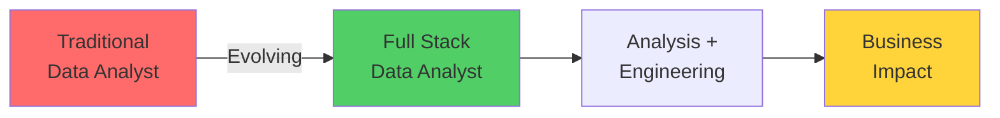

The data analyst role is undergoing a fundamental transformation. Basic reporting is being automated, and the market now demands **full stack data analysts** who can bridge analysis and engineering to deliver end-to-end business solutions.

---

## 🔄 Part 1: The Big Shift

### The Transformation Timeline

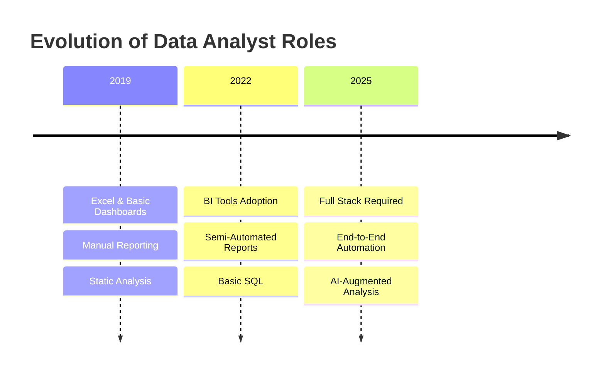

### Key Changes

|**Then (5 Years Ago)**|**Now (2025)**|
|---|---|
|📈 Basic visualizations|🤖 Automated pipelines|
|📊 Manual reporting|⚡ Real-time dashboards|
|📁 Excel-focused|🔧 Python + SQL + BI tools|
|📝 Descriptive analysis|💡 Prescriptive recommendations|

> [!warning] Reality Check **"Just building dashboards means you're competing with machines."**

---

## ⚠️ Part 2: Why the Old Path Is Broken

### The Saturation Problem

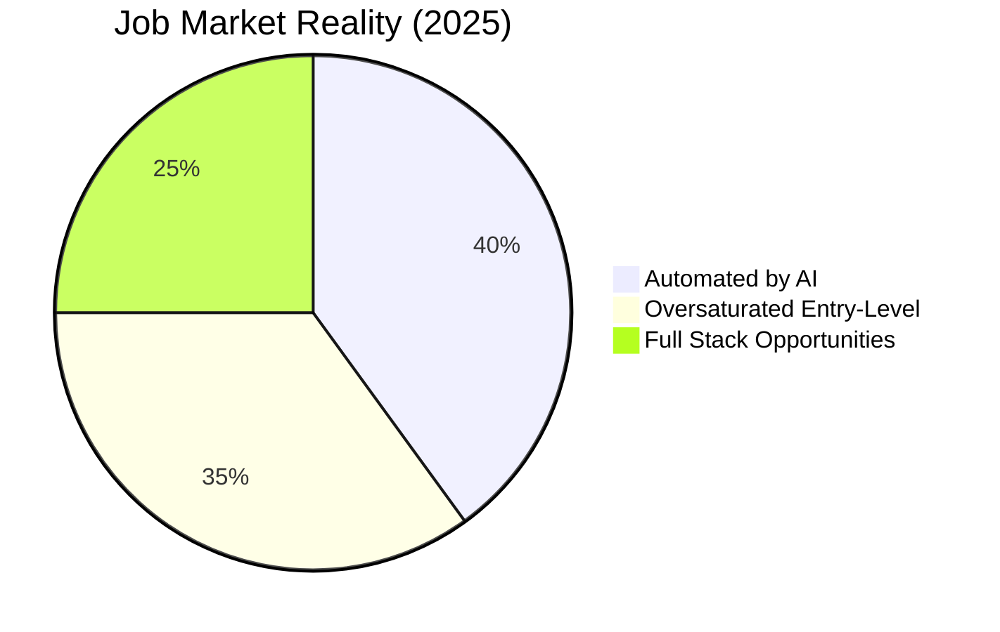

### What's Being Automated

- [x] Basic data collection
- [x] Standard report generation
- [x] Simple visualizations
- [x] Routine SQL queries
- [ ] Complex Problem Solving
- [ ] Business strategy integration
- [ ] Stakeholder communication

> [!danger] The Trap Traditional analyst roles are disappearing because AI can handle **repetitive, rule-based tasks**. The roles that survive require **judgment, creativity, and end-to-end ownership**.

---

## 🚀 Part 3: The New Target Role

## Full Stack Data Analyst

**Also known as:** Analytics Engineer, Business Intelligence Engineer

### Role Definition

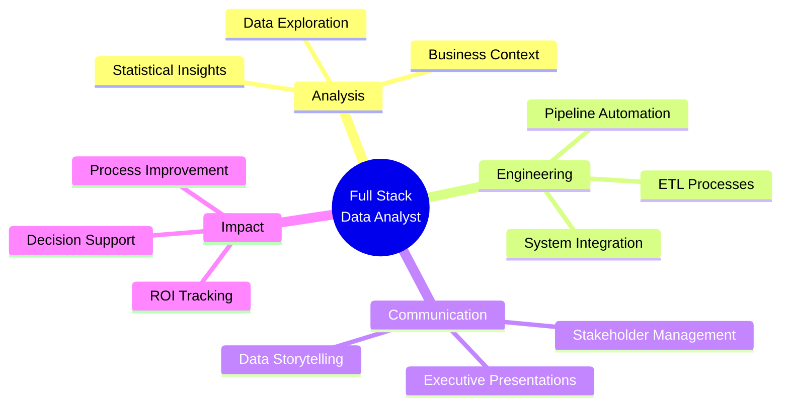

### Responsibilities Breakdown

#### 🔍 **Analysis (40%)**

- Identify business problems
- Perform exploratory data analysis
- Generate actionable insights

#### 🛠️ **Engineering (40%)**

- Build automated data pipelines
- Create scalable reporting systems
- Implement alerting mechanisms

#### 💼 **Business Communication (20%)**

- Present findings to executives
- Translate data into strategy
- Drive organizational decisions

> [!tip] The Differentiator You're not just **reporting what happened**—you're **building systems that continuously surface insights** and **recommending what should happen next**.

---

## 🎓 Part 4: Core Skill Areas

### Skill Development Matrix

|Skill Area|Proficiency Level|Time Investment|Business Impact|
|---|---|---|---|
|Excel & Data Storytelling|⭐⭐⭐⭐⭐|2-3 months|🔥🔥🔥 High|
|BI Tools (Tableau/PowerBI)|⭐⭐⭐⭐⭐|3-4 months|🔥🔥🔥 High|
|SQL|⭐⭐⭐⭐|2-3 months|🔥🔥🔥 High|
|Python (pandas)|⭐⭐⭐⭐|3-4 months|🔥🔥 Medium-High|
|Presentations|⭐⭐⭐⭐⭐|Ongoing|🔥🔥🔥 High|

---

### 📊 A. Excel & Data Storytelling

#### Must-Know Features

```
┌─────────────────────────────────────┐
│  EXCEL MASTERY CHECKLIST            │
├─────────────────────────────────────┤
│  ✅ Pivot Tables & Pivot Charts     │
│  ✅ Power Query (Data Transformation)│
│  ✅ Conditional Formatting           │
│  ✅ XLOOKUP / VLOOKUP / INDEX-MATCH │
│  ✅ Advanced Formulas (SUMIFS, etc.)│
│  ✅ Data Validation & Protection    │
│  ✅ What-If Analysis Tools          │
└─────────────────────────────────────┘
```

#### Data Storytelling Framework

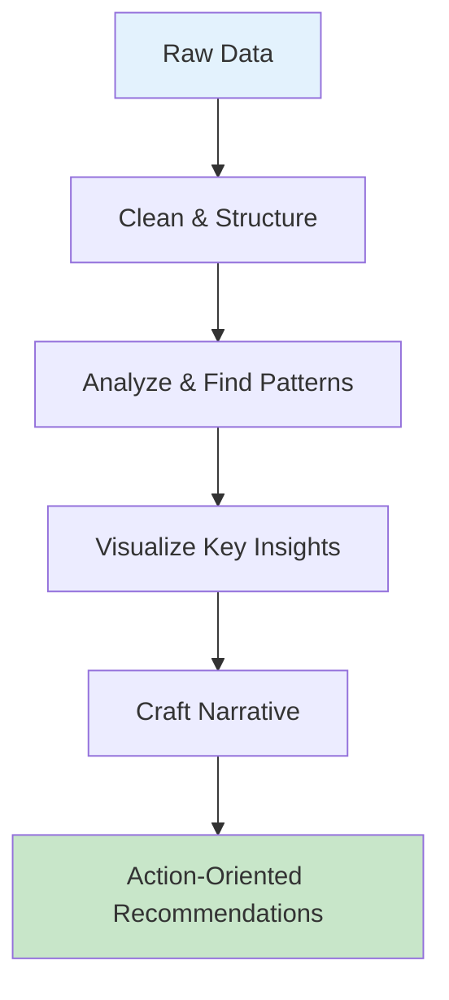

> [!note] The Golden Rule **"Data doesn't speak for itself—you must tell its story."**

---

### 📈 B. Business Intelligence (BI) Tools

#### Tool Selection Strategy

**Choose ONE and master it:**

- **Tableau** → Best for visual creativity and advanced analytics
- **PowerBI** → Best for Microsoft ecosystem integration

#### Dashboard Design Principles

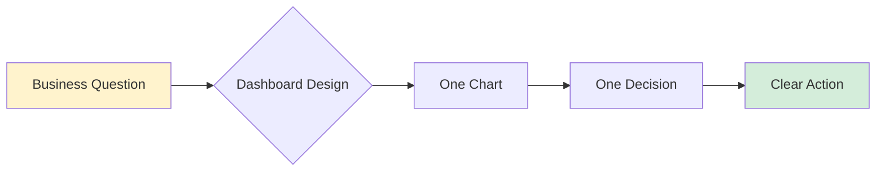

##### The "One Chart, One Decision" Rule

|❌ Bad Dashboard|✅ Good Dashboard|
|---|---|
|15 charts showing everything|5 charts answering key questions|
|"Here's all the data"|"Here's what you need to decide"|
|Cluttered, no hierarchy|Clean, guided flow|
|Technical metrics|Business outcomes|

#### Dashboard Structure Template

```
┌──────────────────────────────────────┐
│  📊 DASHBOARD LAYOUT                 │
├──────────────────────────────────────┤
│  1. KPI Summary (Top)                │
│     → Key metric(s) with trend       │
│                                      │
│  2. Main Insight (Middle)            │
│     → Primary visualization          │
│     → What's happening and why       │
│                                      │
│  3. Supporting Detail (Bottom)       │
│     → Drill-down options             │
│     → Context and comparisons        │
│                                      │
│  4. Action Items (Sidebar/Footer)    │
│     → Recommended next steps         │
└──────────────────────────────────────┘
```

---

### 💼 C. Consulting-Style Presentations

#### The Pyramid Principle

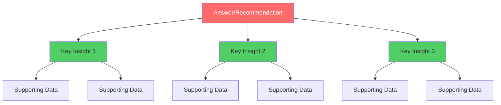

**Structure:** Lead with the answer, then support with evidence.

#### Slide Format Template

```markdown
┌─────────────────────────────────────────────┐
│  [ACTION-ORIENTED TITLE]                    │
│  Example: "Increase email frequency to 2x/week" │
├─────────────────────────────────────────────┤
│                                             │
│  📊 [KEY VISUAL]                            │
│                                             │
├─────────────────────────────────────────────┤
│  KEY INSIGHTS:                              │
│  • Insight 1 (with number)                  │
│  • Insight 2 (with number)                  │
│  • Insight 3 (with number)                  │
│                                             │
│  💡 RECOMMENDATION:                         │
│  → Specific action                          │
│  → Expected outcome                         │
│  → Timeline                                 │
│                                             │
│  📋 NEXT STEPS:                             │
│  1. Immediate action                        │
│  2. Follow-up task                          │
│  3. Success metric                          │
└─────────────────────────────────────────────┘
```

#### Presentation Flow

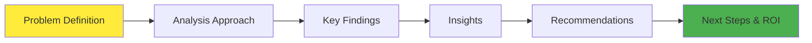

> [!tip] Executive Communication **First 30 seconds = Your entire message.** Everything else is supporting evidence.

---

### 🗄️ D. SQL

#### SQL Proficiency Ladder

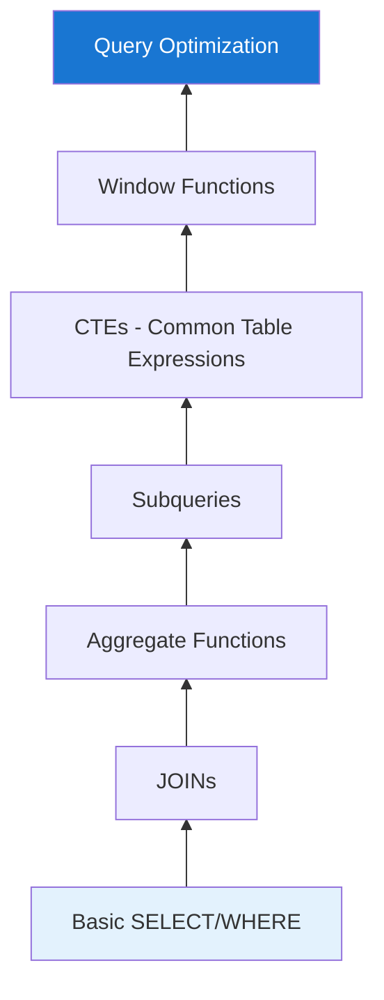

#### Essential SQL Concepts

|Concept|What It Does|When to Use|
|---|---|---|
|**JOINs**|Combine tables|Relating data from multiple sources|
|**CTEs**|Temporary named queries|Complex multi-step logic|
|**Window Functions**|Calculations across rows|Rankings, running totals, moving averages|
|**Subqueries**|Queries within queries|Filtering based on aggregated data|

#### Example Use Case

```sql
-- Practical SQL Pattern: Customer Segmentation
WITH customer_metrics AS (
  SELECT 
    customer_id,
    COUNT(order_id) as order_count,
    SUM(order_value) as total_revenue,
    AVG(order_value) as avg_order_value
  FROM orders
  WHERE order_date >= DATE_SUB(CURRENT_DATE, INTERVAL 12 MONTH)
  GROUP BY customer_id
),
customer_segments AS (
  SELECT 
    *,
    CASE 
      WHEN order_count >= 10 AND total_revenue >= 1000 THEN 'VIP'
      WHEN order_count >= 5 THEN 'Loyal'
      ELSE 'Standard'
    END as segment
  FROM customer_metrics
)
SELECT 
  segment,
  COUNT(*) as customer_count,
  AVG(total_revenue) as avg_revenue_per_customer
FROM customer_segments
GROUP BY segment;
```

---

### 🐍 E. Python (Focused Approach)

#### Python Priority Stack

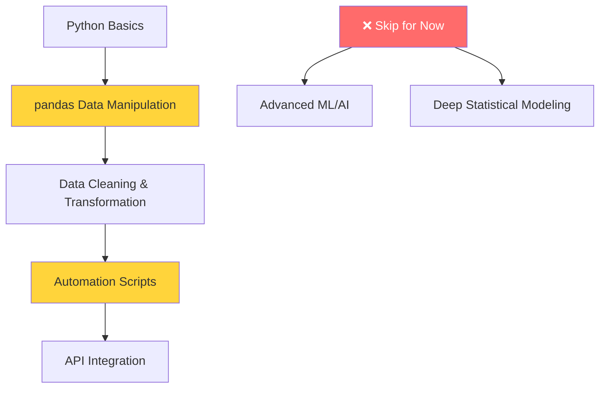

#### Core pandas Operations

```python
# Essential pandas workflow
import pandas as pd

# 1. Read data
df = pd.read_csv('data.csv')

# 2. Clean data
df = df.dropna()  # Remove missing values
df['date'] = pd.to_datetime(df['date'])  # Convert types

# 3. Transform data
df['month'] = df['date'].dt.month
df['revenue_category'] = pd.cut(df['revenue'], 
                                bins=[0, 1000, 5000, float('inf')],
                                labels=['Low', 'Medium', 'High'])

# 4. Aggregate data
summary = df.groupby('category').agg({
    'revenue': ['sum', 'mean', 'count']
}).reset_index()

# 5. Export for visualization
summary.to_csv('dashboard_data.csv', index=False)
```

#### Python for Automation Example

**Use Case:** Daily sales report email

```python
import pandas as pd
import smtplib
from datetime import datetime

# Extract data
df = pd.read_sql("SELECT * FROM sales WHERE date = CURRENT_DATE", conn)

# Transform & analyze
daily_summary = df.groupby('region')['revenue'].sum()

# Generate report
report = f"""
Daily Sales Report - {datetime.now().strftime('%Y-%m-%d')}

Total Revenue: ${df['revenue'].sum():,.2f}
Top Region: {daily_summary.idxmax()} (${daily_summary.max():,.2f})
"""

# Automate delivery (schedule this script daily)
send_email(report, recipients=['team@company.com'])
```

> [!important] Focus Point **Python isn't about fancy algorithms—it's about efficient data manipulation and automation.**

---

## 🎯 Part 5: End-to-End Project Blueprint

### The Full Stack Data Analyst Workflow

```

1. 📋 Identify Business Problem
   ↓
2. 🔄 Data Collection & Pipeline
   ↓
3. 🧹 Data Cleaning & Transformation
   ↓
4. 📊 Analysis & Segmentation
   ↓
5. 📈 Dashboard Creation
   ↓
6. 🔔 Alert System Setup
   ↓
7. 💼 Executive Presentation
   ↓
8. ⚙️ Implementation & Monitoring
```

### Step-by-Step Breakdown

#### Phase 1: Build → Automate

|Step|Technology|Deliverable|
|---|---|---|
|**1. Data Pipeline**|SQL + Python|Automated data extraction from multiple sources|
|**2. Data Transformation**|Python (pandas)|Clean, structured dataset ready for analysis|
|**3. Storage**|Database/CSV|Centralized data repository|

#### Phase 2: Analyze → Insight

|Step|Technology|Deliverable|
|---|---|---|
|**4. Exploratory Analysis**|SQL + Python|Key patterns, trends, anomalies|
|**5. Segmentation**|SQL + Python|Customer/product groups, cohorts|
|**6. Statistical Testing**|Python|Validated hypotheses|

#### Phase 3: Visualize → Communicate

|Step|Technology|Deliverable|
|---|---|---|
|**7. Dashboard**|Tableau/PowerBI|Interactive, real-time reporting|
|**8. Alert System**|Python + Email/Slack|Automated notifications for key events|
|**9. Presentation**|PowerPoint/Slides|Executive-ready recommendations|

#### Phase 4: Impact → ROI

|Step|Technology|Deliverable|
|---|---|---|
|**10. Implementation Plan**|Documentation|Actionable roadmap with owners|
|**11. Success Metrics**|Dashboard + Reports|KPI tracking and ROI measurement|

---

### 📋 Example Project: E-commerce Customer Retention

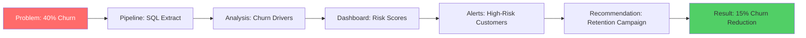

**What You Built:**

1. ✅ Automated pipeline pulling transaction data
2. ✅ Python script identifying at-risk customers
3. ✅ Dashboard showing retention metrics by segment
4. ✅ Email alerts when VIP customers show churn signals
5. ✅ Executive deck with targeted retention strategy

**Business Impact:**

- 📊 Identified $500K revenue at risk
- 🎯 Reduced churn by 15% in pilot segment
- 💰 ROI: 8x investment in retention campaign

---

## 🚪 Part 6: Breaking Into the Industry

### The Strategic Approach

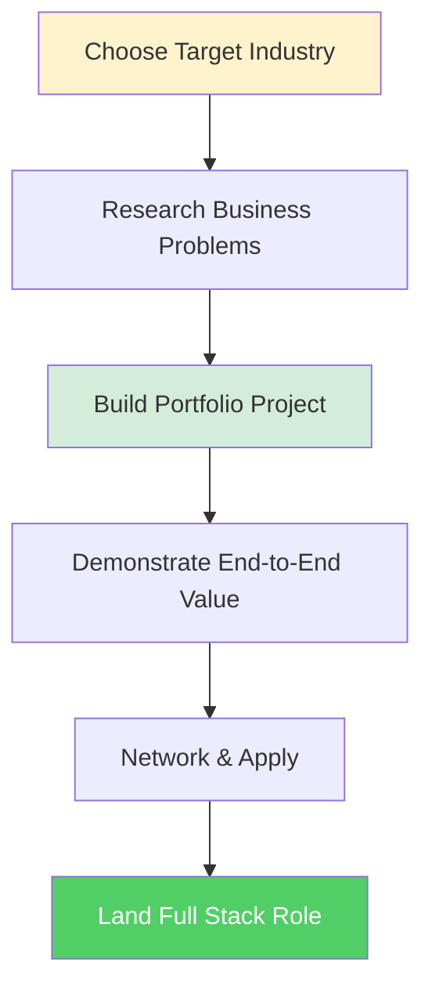

### Industry Selection Framework

|Industry|Common Problems|Data Sources|Skills Emphasized|
|---|---|---|---|
|**Retail**|Inventory optimization, customer retention|Sales data, CRM|Segmentation, forecasting|
|**Healthcare**|Patient outcomes, resource allocation|EHR, claims data|Compliance, privacy|
|**Finance**|Risk assessment, fraud detection|Transaction data|Security, accuracy|
|**Tech/SaaS**|User engagement, churn prediction|Product analytics|A/B testing, funnels|

### Portfolio Project Checklist

Your project should demonstrate:

- [ ] **Business Context** → What real problem does this solve?
- [ ] **Data Pipeline** → Automated data collection/refresh
- [ ] **Analysis** → Meaningful insights with statistical backing
- [ ] **Visualization** → Professional dashboard (Tableau/PowerBI)
- [ ] **Automation** → Scripts that run without manual intervention
- [ ] **Presentation** → Executive summary with recommendations
- [ ] **GitHub Repository** → Well-documented code
- [ ] **ROI Calculation** → Estimated business impact

> [!tip] Portfolio Power-Up **Don't just show technical skills—tell the business story.** Hiring managers want to see you understand the "why" behind the "what."

---

### 📝 Project Documentation Template

```markdown
# Project Title: [Problem You Solved]

## 🎯 Business Problem
[1-2 sentences describing the actual business challenge]

## 📊 Solution Overview
[High-level approach: data sources, methodology, deliverables]

## 🛠️ Technical Stack
- Data Pipeline: [SQL, Python, APIs used]
- Analysis: [Tools and techniques]
- Visualization: [Dashboard platform]
- Automation: [Scheduling/alerting systems]

## 💡 Key Insights
1. [Insight with number/impact]
2. [Insight with number/impact]
3. [Insight with number/impact]

## 📈 Business Impact
- [Quantified outcome 1]
- [Quantified outcome 2]
- [ROI estimate]

## 🔗 Links
- [Live Dashboard]
- [GitHub Repository]
- [Presentation Deck]
```

---

## 📚 Quick Reference Guide

### The Modern Data Analyst Tech Stack

```
┌─────────────────────────────────────────────┐
│  FOUNDATIONAL LAYER                         │
│  • Excel (Power Query, Pivot Tables)        │
│  • SQL (Intermediate to Advanced)           │
└─────────────────────────────────────────────┘
                    ↓
┌─────────────────────────────────────────────┐
│  AUTOMATION LAYER                           │
│  • Python (pandas, automation scripts)      │
│  • APIs & Data Integration                  │
└─────────────────────────────────────────────┘
                    ↓
┌─────────────────────────────────────────────┐
│  VISUALIZATION LAYER                        │
│  • Tableau OR PowerBI (choose one)          │
│  • Dashboard Design Principles              │
└─────────────────────────────────────────────┘
                    ↓
┌─────────────────────────────────────────────┐
│  COMMUNICATION LAYER                        │
│  • Presentation Skills (Pyramid Principle)  │
│  • Data Storytelling                        │
│  • Business Acumen                          │
└─────────────────────────────────────────────┘
```

---

### Career Development Timeline

|Phase|Duration|Focus|Milestone|
|---|---|---|---|
|**Foundation**|Months 1-2|Excel, SQL basics|Complete 3 SQL projects|
|**Analysis**|Months 2-4|BI tools, visualization|Build first dashboard|
|**Automation**|Months 4-6|Python, scripting|Create automated report|
|**Integration**|Months 6-8|End-to-end project|Complete portfolio project|
|**Job Search**|Months 8-10|Networking, applications|Land first role|

---

### Key Principles to Remember

> [!success] The 5 Rules of Modern Data Analysis
> 
> 1. **Solve business problems, not just data problems**
> 2. **Automate everything that can be automated**
> 3. **One chart = one decision**
> 4. **Lead with the answer, support with evidence**
> 5. **Show ROI in every project**

---

## 🎬 Taking Action

### Your Next Steps

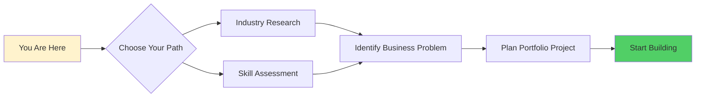

### Reflection Exercise

**Answer these questions:**

1. **Industry Selection**
    
    - What industry am I most interested in?
    - What business problems exist in that industry?
2. **Current Skills Gap**
    
    - Which technical skills do I need to develop?
    - Which soft skills (communication, storytelling) need work?
3. **Project Idea**
    
    - What business problem could I solve in a portfolio project?
    - What data sources are available to me?
    - What would the end-to-end solution look like?

---

### 🚀 Challenge: Your First Full Stack Project

**Pick one:**

**Retail:** Build a customer segmentation system with automated weekly reports

- Pipeline: Extract sales data
- Analysis: RFM segmentation (Recency, Frequency, Monetary)
- Dashboard: Customer value by segment
- Alert: Notify when VIP customers haven't purchased in 30 days

**SaaS:** Create a user engagement scoring system

- Pipeline: Extract product usage data
- Analysis: Engagement score based on feature usage
- Dashboard: Health score by account
- Alert: Flag accounts at risk of churn

**Healthcare:** Develop a patient readmission risk model

- Pipeline: Extract patient history
- Analysis: Identify readmission risk factors
- Dashboard: Risk scores by department
- Alert: Notify staff of high-risk discharges

---

## 📖 Additional Resources

### Recommended Learning Path

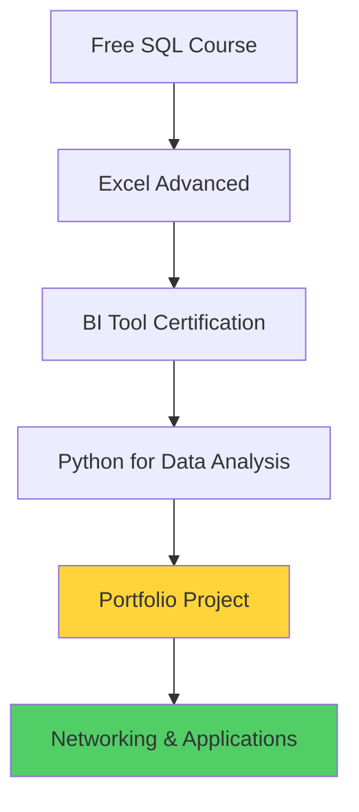

### Community & Support

- **Practice Platforms:** LeetCode (SQL), Kaggle (datasets)
- **Portfolio Hosting:** GitHub, Tableau Public, PowerBI Service
- **Networking:** LinkedIn, industry meetups, data community Slack groups

---

## 🎯 Final Thoughts

The transition from traditional data analyst to full stack data analyst isn't just about learning new tools—it's about **shifting your mindset from reporter to builder**, from insight-finder to solution-creator.

> [!quote] Remember **"The best data analysts don't just tell you what happened—they build systems that continuously improve how decisions are made."**

**You're not competing with AI. You're using AI as a tool while providing the strategic thinking, business context, and end-to-end problem-solving that only humans can deliver.**

---

## 🔖 Bookmarks & Tags

`#data-analytics` `#career-development` `#sql` `#python` `#business-intelligence` `#portfolio` `#automation` `#data-storytelling`

---

**Study Guide Version:** 1.0  
**Last Updated:** October 16, 2025  
**Source:** Kedeisha Bryan via YouTube


References